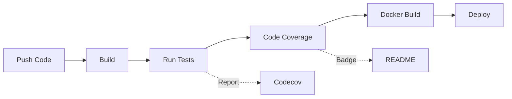

# 🎬 FiapX - Apresentação Executiva

## 📊 Slide 1: Introdução

### Sistema FiapX
**Processamento Inteligente de Vídeos em Frames**

- 🎯 **Objetivo**: Extrair frames de vídeos e gerar ZIP para download
- 🏆 **Resultado**: 80.97% de cobertura de testes
- 🚀 **Arquitetura**: Clean Architecture + Event-Driven
- ⚡ **Performance**: Processamento assíncrono escalável

---

## 📊 Slide 2: Métricas de Qualidade

### Cobertura de Testes: 80.97%

| Camada | Cobertura | Status |
|--------|-----------|--------|
| **Application** | 98.71% | 🏆 Excepcional |
| **API** | 88.80% | ✅ Excelente |
| **Domain** | 87.80% | ✅ Excelente |
| **Shared** | 86.36% | ✅ Excelente |
| **Infrastructure** | 74.09% | ✅ Bom |
| **Worker** | 73.42% | ✅ Bom |

**Total**: 1630 de 2013 linhas cobertas  
**Testes**: ~300 testes unitários  

---

## 📊 Slide 3: Arquitetura - Visão Geral

```
┌────────────────┐
│    Cliente     │
└───────┬────────┘
        │ HTTPS
┌───────▼────────┐      ┌──────────────┐
│   API REST     │─────▶│  PostgreSQL  │
│  (ASP.NET 8)   │      │  (Metadata)  │
└───────┬────────┘      └──────────────┘
        │
        │ Events
┌───────▼────────┐      ┌──────────────┐
│   RabbitMQ     │─────▶│    Worker    │
│  (Messaging)   │      │   (FFmpeg)   │
└────────────────┘      └──────┬───────┘
                               │
                        ┌──────▼───────┐
                        │   Storage    │
                        │ (Videos/ZIP) │
                        └──────────────┘
```

---

## 📊 Slide 4: Princípios Arquiteturais

### ✅ SOLID Completo

- **S**ingle Responsibility: Uma responsabilidade por classe
- **O**pen/Closed: Extensível via interfaces
- **L**iskov Substitution: Contratos respeitados
- **I**nterface Segregation: Interfaces específicas
- **D**ependency Inversion: Dependências → Abstrações

### ✅ Clean Architecture

```
Presentation → Application → Domain ← Infrastructure
```

### ✅ Domain-Driven Design

- Aggregates: User, Video
- Events: VideoUploaded, VideoProcessed
- Policies: Retry, Notification

---

## 📊 Slide 5: Tecnologias Utilizadas

### Stack Principal

| Categoria | Tecnologia |
|-----------|-----------|
| **Backend** | .NET 8.0 (LTS) |
| **API** | ASP.NET Core 8 |
| **Database** | PostgreSQL 16 |
| **Cache** | Redis 7 |
| **Message Broker** | RabbitMQ 3.13 |
| **Processing** | FFMpegCore |
| **Logging** | Serilog + Seq |
| **Testing** | xUnit + Moq + FluentAssertions |
| **CI/CD** | GitHub Actions + Codecov |

---

## 📊 Slide 6: Padrões de Projeto

### Implementados

✅ **Repository Pattern**: Abstração de dados  
✅ **Unit of Work**: Gerenciamento de transações  
✅ **CQRS**: Separação Commands/Queries  
✅ **Event Sourcing**: Eventos de domínio  
✅ **Circuit Breaker**: Proteção contra falhas  
✅ **Retry Policy**: Resiliência automática  
✅ **Dependency Injection**: IoC Container  

---

## 📊 Slide 7: Resiliência

### Garantias de Processamento

```yaml
✅ At-Least-Once Delivery (RabbitMQ)
✅ Retry Automático (3 tentativas)
✅ Backoff Exponencial (1s → 5s → 15s)
✅ Circuit Breaker (15% taxa de erro)
✅ Dead Letter Queue (falhas definitivas)
✅ Timeout de 10 minutos (processamento)
```

### Cenário de Falha

```
Tentativa 1: ❌ Erro → Retry em 1s
Tentativa 2: ❌ Erro → Retry em 5s
Tentativa 3: ❌ Erro → Dead Letter Queue
              ✉️ Notificação Telegram
```

---

## 📊 Slide 8: Escalabilidade

### Horizontal Scaling

```
┌─────────┐  ┌─────────┐  ┌─────────┐
│  API 1  │  │  API 2  │  │  API 3  │
└────┬────┘  └────┬────┘  └────┬────┘
     └───────────┬───────────┘
                 │
          ┌──────▼──────┐
          │ RabbitMQ    │
          └──────┬──────┘
     ┌───────────┼───────────┐
     │           │           │
┌────▼────┐ ┌───▼─────┐ ┌──▼──────┐
│Worker 1 │ │Worker 2 │ │Worker 3 │
└─────────┘ └─────────┘ └─────────┘
```

**Vantagem**: Adicionar workers sem alterar código

---

## 📊 Slide 9: Observabilidade

### Logs Estruturados (Serilog + Seq)

```json
{
  "level": "Information",
  "message": "Video processing completed",
  "videoId": "abc-123",
  "frameCount": 300,
  "duration": "00:05:23"
}
```

### Métricas (Prometheus)

- Total de vídeos enviados
- Total de vídeos processados
- Tempo médio de processamento
- Taxa de falha

### Health Checks

✅ PostgreSQL  
✅ Redis  
✅ RabbitMQ  
✅ Storage

---

## 📊 Slide 10: Segurança

### Autenticação

```
POST /api/auth/login
{
  "email": "user@example.com",
  "password": "senha"
}

Response:
{
  "token": "eyJhbGciOiJIUzI1NiIs...",
  "expiresAt": "2024-01-30T23:00:00Z"
}
```

### Proteções

- ✅ JWT com expiração (60 min)
- ✅ Senha com BCrypt (salt rounds: 12)
- ✅ Validação com FluentValidation
- ✅ Isolamento por usuário
- ✅ HTTPS obrigatório

---

## 📊 Slide 11: CI/CD Pipeline



### Automação Completa

✅ Build automatizado  
✅ Testes em cada commit  
✅ Cobertura no Codecov  
✅ Docker build condicional  
✅ Badges no README  

---

## 📊 Slide 12: Testes - Estratégia

### Pirâmide de Testes

```
        /\
       /UI\ ← Nenhum (fora do escopo)
      /────\
     /  E2E  \ ← Limitado (API integration)
    /────────\
   /   Unit    \ ← 300 testes (80%+ cobertura)
  /────────────\
```

### Categorias de Testes

- ✅ **Unit Tests**: Use Cases, Validators, Repositories
- ✅ **Integration Tests**: API, Database, Messaging
- ✅ **Component Tests**: Controllers, Services

---

## 📊 Slide 13: Event Storming

### Eventos Principais

```
UserRegistered → UserLoggedIn → VideoUploaded 
    → VideoQueued → VideoProcessingStarted 
    → FramesExtracted → ZipCreated 
    → VideoProcessingCompleted → VideoDownloaded
```

### Agregados

- **User**: Id, Email, PasswordHash, Name
- **Video**: Id, UserId, Status, FrameCount, ZipPath

### Políticas

- Quando VideoUploaded → Enfileirar
- Quando ProcessingFailed (< 3x) → Retry
- Quando ProcessingCompleted → Notificar

---

## 📊 Slide 14: Trade-offs Arquiteturais

### Decisões Importantes

| Aspecto | Escolha | Trade-off Aceito |
|---------|---------|------------------|
| **Consistência** | Eventual | Disponibilidade++ |
| **State** | Stateless | Sem revogação de token |
| **Deployment** | Containers | Complexidade de infra |
| **Processing** | Async | Feedback não imediato |
| **Storage** | File System | Não distribuído |

---

## 📊 Slide 15: Comparação com Alternativas

### Por que Clean Architecture?

| Arquitetura | Testabilidade | Manutenibilidade | Escalabilidade |
|-------------|---------------|------------------|----------------|
| **Clean** ✅ | ⭐⭐⭐⭐⭐ | ⭐⭐⭐⭐⭐ | ⭐⭐⭐⭐ |
| Layered | ⭐⭐⭐ | ⭐⭐⭐ | ⭐⭐⭐ |
| Microservices | ⭐⭐⭐⭐ | ⭐⭐ | ⭐⭐⭐⭐⭐ |

### Por que Event-Driven?

✅ Desacoplamento temporal  
✅ Escalabilidade horizontal  
✅ Resiliência natural  
❌ Complexidade em debugging  
❌ Consistência eventual  

---

## 📊 Slide 16: Lições Aprendidas

### ✅ O que Funcionou Bem

- Clean Architecture facilitou testes (80%+)
- Event-Driven permitiu escalar Workers
- MassTransit simplificou retry/circuit breaker
- Serilog+Seq salvaram em troubleshooting

### ⚠️ Desafios Enfrentados

- FFmpeg download automático (primeira execução)
- Debugging de mensageria assíncrona
- Testes de integration com RabbitMQ

### 🔮 Melhorias Futuras

- Limpeza automática de arquivos antigos
- Refresh token para JWT
- Processamento em GPU (se disponível)
- Suporte a mais formatos de vídeo

---

## 📊 Slide 17: Demonstração de Código

### Use Case (Application Layer)

```csharp
public class UploadVideoUseCase : IUploadVideoUseCase
{
    private readonly IUnitOfWork _unitOfWork;
    private readonly IStorageService _storage;
    private readonly IMessagePublisher _publisher;
    
    public async Task<Result<VideoResponse>> ExecuteAsync(
        UploadVideoRequest request)
    {
        // 1. Salvar arquivo
        var path = await _storage.SaveVideoAsync(...);
        
        // 2. Criar entidade
        var video = new Video(...);
        
        // 3. Persistir
        await _unitOfWork.Videos.AddAsync(video);
        await _unitOfWork.SaveChangesAsync();
        
        // 4. Publicar evento
        await _publisher.PublishAsync(
            new VideoUploadedEvent(video.Id));
        
        return Result.Success(...);
    }
}
```

---

## 📊 Slide 18: Demonstração de Testes

### Teste de Use Case

```csharp
[Fact]
public async Task Execute_WithValidRequest_ShouldUploadVideo()
{
    // Arrange
    var request = new UploadVideoRequest(...);
    var useCase = new UploadVideoUseCase(...);
    
    // Act
    var result = await useCase.ExecuteAsync(request);
    
    // Assert
    result.IsSuccess.Should().BeTrue();
    result.Data.Status.Should().Be(VideoStatus.Uploaded);
    _publisherMock.Verify(x => 
        x.PublishAsync(It.IsAny<VideoUploadedEvent>()), 
        Times.Once);
}
```

---

## 📊 Slide 19: Roadmap Futuro

### Curto Prazo (3 meses)

- ✅ Refresh Token para JWT
- ✅ Limpeza automática de storage
- ✅ Dashboard de métricas (Grafana)

### Médio Prazo (6 meses)

- ⬜ Processamento em GPU
- ⬜ Suporte a mais formatos
- ⬜ API de webhooks

### Longo Prazo (1 ano)

- ⬜ ML para detecção de cenas
- ⬜ Cloud storage (S3)
- ⬜ CDN para downloads

---

## 📊 Slide 20: Conclusão

### Objetivos Alcançados

✅ **Arquitetura de Excelência**: Clean + Event-Driven  
✅ **Qualidade Comprovada**: 80.97% cobertura  
✅ **Escalabilidade**: Horizontal scaling ready  
✅ **Resiliência**: Retry, circuit breaker, timeouts  
✅ **Observabilidade**: Logs, métricas, health checks  
✅ **Boas Práticas**: SOLID, DDD, CQRS  

### Diferenciais

🏆 Application Layer com 98.71% de cobertura  
🏆 ~300 testes unitários  
🏆 CI/CD completo com Codecov  
🏆 Documentação arquitetural completa  
🏆 Event Storming e diagramas C4  

---

## 📊 Slide 21: Perguntas?

### Contato

**Desenvolvedor**: Wesley Gynther  
**Instituição**: FIAP  
**Repositório**: github.com/wesleygyn/TechChallenge-fase-5-FIAP  
**Codecov**: codecov.io/gh/wesleygyn/TechChallenge-fase-5-FIAP  

### Recursos

- 📖 Documentação completa em `/docs`
- 🎭 Event Storming em `/docs/event-storming.md`
- 🏛️ Diagramas C4 em `/docs/diagramas-c4.md`
- 📐 ADRs em `/docs/architecture-document.md`

---

**Obrigado!** 🎓
