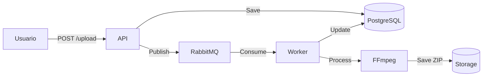

# 📐 Documento de Arquitetura - Sistema FiapX

## 🎯 Visão Geral

### Objetivo do Sistema
Sistema de processamento de vídeos que extrai frames (imagens) de vídeos enviados por usuários e disponibiliza em formato ZIP para download.

### Características Principais
- ✅ **Escalável**: Arquitetura permite escalar horizontalmente
- ✅ **Resiliente**: Retry automático, circuit breaker, timeouts
- ✅ **Observável**: Logs estruturados, métricas, health checks
- ✅ **Testável**: 80%+ de cobertura de testes
- ✅ **Manutenível**: Clean Architecture, SOLID, DDD

---

## 🏛️ Padrões Arquiteturais Aplicados

### 1. Clean Architecture
```
┌─────────────────────────────────────┐
│        Presentation Layer           │ ← Controllers, Middlewares
├─────────────────────────────────────┤
│        Application Layer            │ ← Use Cases, DTOs, Validators
├─────────────────────────────────────┤
│           Domain Layer              │ ← Entities, Events, Interfaces
├─────────────────────────────────────┤
│      Infrastructure Layer           │ ← Repositories, Services
└─────────────────────────────────────┘
```

### 2. CQRS (Commands/Queries)
- **Commands**: RegisterUser, UploadVideo (alteram estado)
- **Queries**: GetUserVideos, GetVideoStatus (apenas leitura)

### 3. Event-Driven Architecture
- Comunicação assíncrona via RabbitMQ
- Desacoplamento entre API e Worker

### 4. Repository Pattern + Unit of Work
- Abstração de acesso a dados
- Transações gerenciadas centralmente

---

## 📊 Qualidade e Métricas

### Cobertura de Testes
```
Total:         80.97% (1630/2013 linhas)

API:           88.80%  ████████████████████░
Application:   98.71%  ███████████████████▓
Domain:        87.80%  █████████████████▓░░
Infrastructure:74.09%  ███████████████░░░░
Shared:        86.36%  █████████████████░░░
Worker:        73.42%  ██████████████▓░░░░░
```

### Princípios SOLID

✅ **S**ingle Responsibility: Cada classe tem uma única responsabilidade
✅ **O**pen/Closed: Extensível via interfaces, fechado para modificação
✅ **L**iskov Substitution: Todas implementações respeitam contratos
✅ **I**nterface Segregation: Interfaces específicas (não genéricas)
✅ **D**ependency Inversion: Dependências apontam para abstrações

---

## 🔄 Fluxos Principais

### Upload e Processamento


---

## 🎯 Trade-offs e Decisões

### 1. Consistência Eventual vs Disponibilidade
**Decisão**: Priorizar Disponibilidade  
**Justificativa**: Upload retorna 202 imediatamente, processamento é assíncrono  
**Trade-off**: Status pode demorar alguns segundos para atualizar

### 2. Stateless vs Stateful
**Decisão**: API e Worker completamente stateless  
**Justificativa**: Permite escalar horizontalmente  
**Trade-off**: Não é possível revogar tokens JWT antes da expiração

### 3. Monolito vs Microservices
**Decisão**: Monolito modular (Clean Architecture)  
**Justificativa**: Complexidade adequada ao escopo  
**Trade-off**: Deploy conjunto API+Worker (mas containers separados)

---

## 🛡️ Resiliência

### Retry Policies
```yaml
Tentativa 1: delay 1s
Tentativa 2: delay 5s (backoff exponencial)
Tentativa 3: delay 15s (última tentativa)
Após 3 falhas: Dead Letter Queue
```

### Circuit Breaker
```yaml
Janela: 1 minuto
Taxa de erro: 15%
Mínimo de requisições: 10
Tempo de recuperação: 5 minutos
```

### Timeouts
```yaml
FFmpeg processing: 10 minutos
Database queries: 30 segundos
HTTP requests: 100 segundos
```

---

## 📈 Escalabilidade

### Horizontal Scaling
- **API**: Load balancer → N instâncias
- **Worker**: N containers consumindo mesma fila
- **Database**: Read replicas (futuro)

### Vertical Scaling
- CPU: Aumentar para processamento mais rápido
- RAM: Vídeos grandes requerem mais memória
- Storage: SSD para melhor I/O

---

## 🔐 Segurança

### Autenticação
- JWT com HS256
- Tokens expiram em 60 minutos
- Senha com BCrypt (salt rounds: 12)

### Autorização
- Resource-based: Usuário só acessa seus vídeos
- Claims no token: UserId, Email, Name

### Validação
- FluentValidation em todos os inputs
- Tamanho máximo: 2GB
- Formatos permitidos: mp4, avi, mov, mkv, wmv, flv, webm, m4v

---

## 📊 Observabilidade

### Logs Estruturados (Serilog + Seq)
```json
{
  "timestamp": "2024-01-30T10:15:30Z",
  "level": "Information",
  "message": "Video processing completed",
  "videoId": "abc-123",
  "userId": "xyz-789",
  "frameCount": 300,
  "duration": "00:05:23"
}
```

### Métricas (Prometheus)
- `total_videos_uploaded`
- `total_videos_processed`
- `processing_duration_seconds`
- `total_processing_failures`

### Health Checks
- PostgreSQL: Connectivity
- Redis: Ping/Pong
- RabbitMQ: Queue health
- Storage: Disk space

---

## 🚀 Deploy e Infraestrutura

### Containers
```yaml
api:
  image: fiapx-api:latest
  replicas: 2
  resources:
    cpu: 1
    memory: 512MB

worker:
  image: fiapx-worker:latest
  replicas: 3
  resources:
    cpu: 2
    memory: 2GB
```

### CI/CD Pipeline
```
Push → Build → Test → Coverage → Docker → Deploy
```

---

**Desenvolvido com excelência arquitetural para FIAP** 🏆
