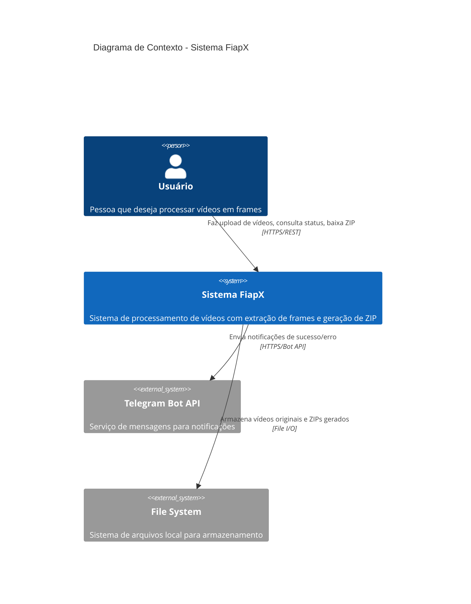
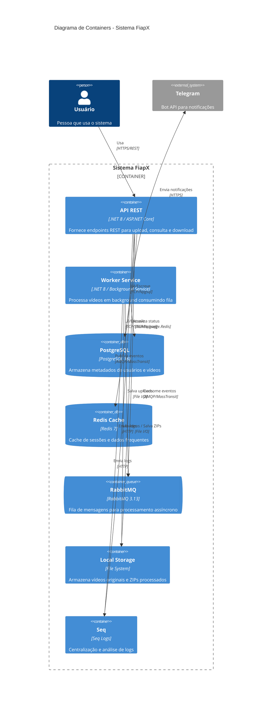
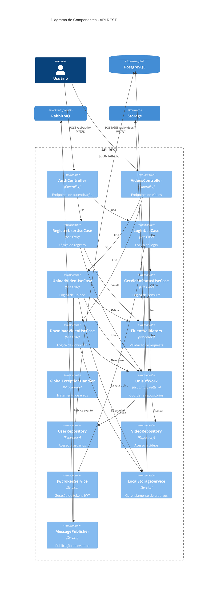
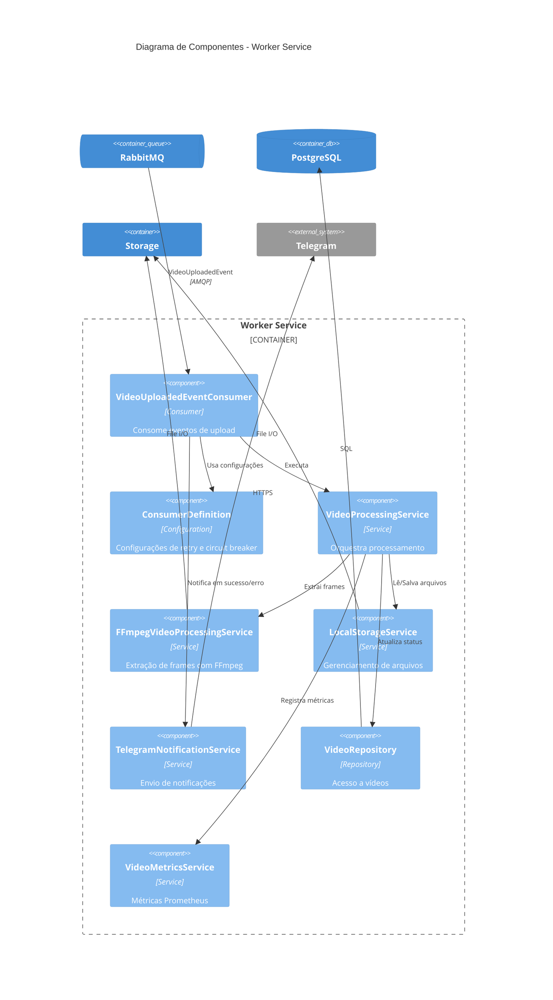
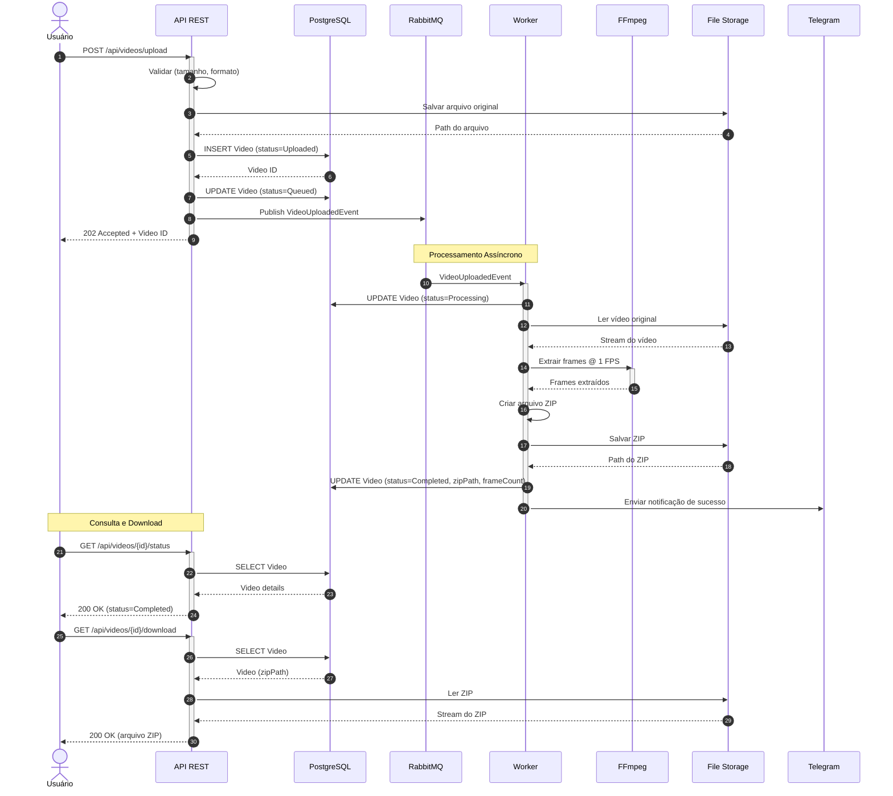
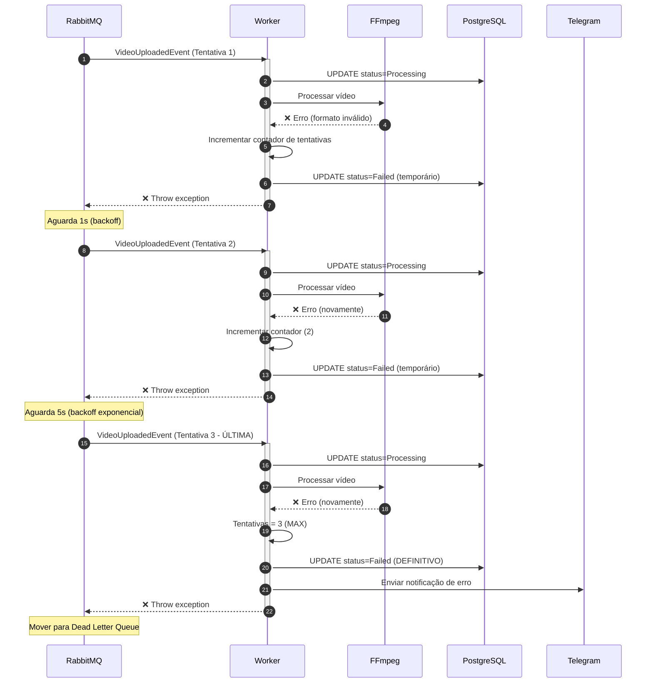
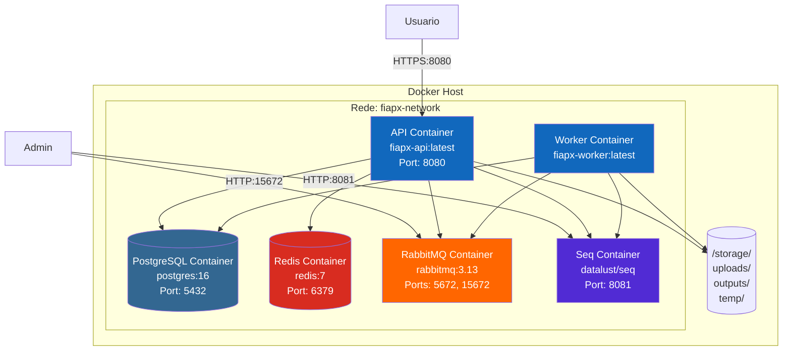
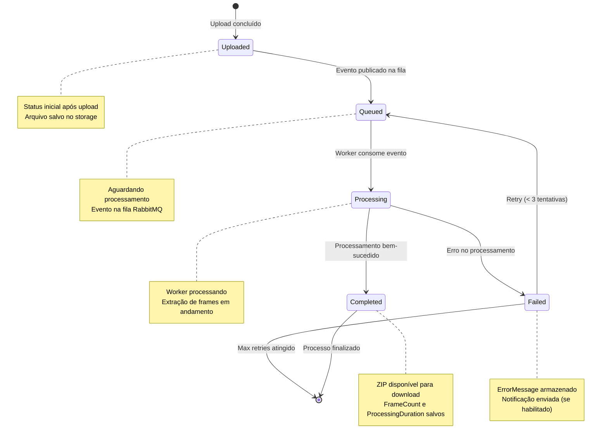
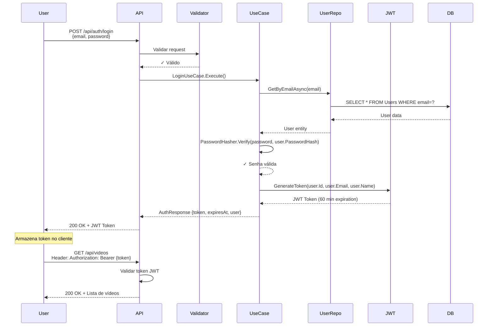

# 🏛️ Diagramas C4 - Sistema FiapX

## 📖 Sobre C4

O modelo C4 (Context, Containers, Components, Code) é uma técnica de diagramação criada por Simon Brown para visualizar arquitetura de software em diferentes níveis de abstração.

---

## 🌍 Nível 1: Diagrama de Contexto

Mostra o sistema como uma caixa preta e suas interações externas.

### Exportar para Draw.io:
1. Copie o código Mermaid acima
2. Abra draw.io → Insert → Advanced → Mermaid
3. Cole o código

---

## 📦 Nível 2: Diagrama de Containers

Mostra os containers (aplicações, serviços, bancos de dados) que compõem o sistema.

### Componentes Principais:

| Container | Tecnologia | Responsabilidade |
|-----------|-----------|------------------|
| **API REST** | ASP.NET Core 8 | Autenticação, upload, consultas, download |
| **Worker** | .NET Background Service | Processamento de vídeos com FFmpeg |
| **PostgreSQL** | PostgreSQL 16 | Persistência de metadados |
| **Redis** | Redis 7 | Cache para performance |
| **RabbitMQ** | RabbitMQ 3.13 | Mensageria assíncrona |
| **Storage** | File System | Armazenamento de arquivos |
| **Seq** | Seq | Observabilidade e logs |

---

## 🔧 Nível 3: Diagrama de Componentes - API

Mostra os componentes internos da API.

---

## 🔧 Nível 3: Diagrama de Componentes - Worker

Mostra os componentes internos do Worker.

---

## 🔄 Diagrama de Sequência - Upload e Processamento

---

## 🔄 Diagrama de Sequência - Tratamento de Erro com Retry

---

## 🏗️ Diagrama de Deployment

---

## 📊 Diagrama de Estados - Video Lifecycle

---

## 🔐 Diagrama de Autenticação - JWT Flow

---

**Todos os diagramas acima são compatíveis com:**
- ✅ Mermaid Live Editor
- ✅ Draw.io (via plugin Mermaid)
- ✅ VS Code (via extensão Mermaid)
- ✅ GitHub/GitLab (renderização nativa)
- ✅ Confluence (via plugin)

---

**Desenvolvido com C4 Model para FIAP** 🏛️
