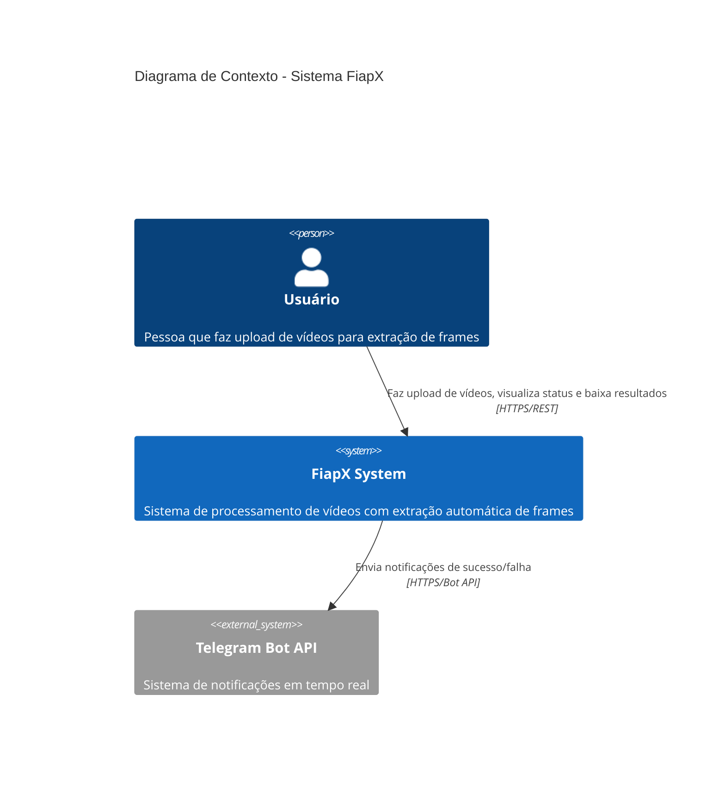

# Diagrama C4 - Nível 1: Contexto do Sistema

Este diagrama mostra o contexto geral do sistema FiapX e como ele interage com usuários e sistemas externos.

## Descrição

**Usuário:**
- Faz upload de vídeos através da API REST
- Visualiza lista de vídeos processados
- Verifica status do processamento
- Baixa arquivo ZIP com frames extraídos

**Sistema FiapX:**
- Recebe vídeos via API REST
- Processa vídeos de forma assíncrona
- Extrai frames (1 por segundo)
- Gera arquivo ZIP
- Notifica usuário sobre conclusão

**Telegram Bot API:**
- Recebe comandos do sistema
- Envia notificações push
- Informa sucesso ou falha no processamento
