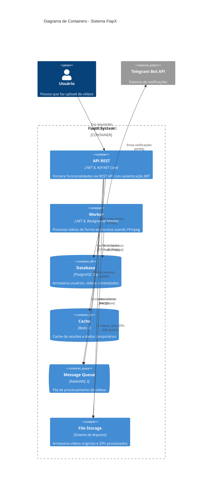

# Diagrama C4 - Nível 2: Containers

Este diagrama mostra os containers (aplicações e armazenamentos de dados) que compõem o sistema FiapX.



## Containers Detalhados

### 1. API REST (.NET 8)
**Responsabilidades:**
- Autenticação e autorização (JWT)
- Endpoints REST para upload, listagem e download
- Validação de requisições
- Publicação de eventos na fila
- Health checks

**Tecnologias:**
- ASP.NET Core 8
- Entity Framework Core
- MassTransit (RabbitMQ)
- Serilog

**Porta:** 8080

---

### 2. Worker (.NET 8)
**Responsabilidades:**
- Consumir eventos da fila RabbitMQ
- Processar vídeos com FFmpeg
- Extrair frames (1 fps)
- Gerar arquivo ZIP
- Atualizar status no banco
- Enviar notificações via Telegram

**Tecnologias:**
- .NET 8 Background Service
- FFmpeg
- MassTransit
- Telegram.Bot

---

### 3. PostgreSQL 16
**Responsabilidades:**
- Persistência de usuários
- Persistência de vídeos e status
- Controle transacional

**Schemas:**
- Users (Id, Name, Email, PasswordHash)
- Videos (Id, UserId, OriginalFileName, Status, ProcessedAt, ZipPath)

---

### 4. Redis 7
**Responsabilidades:**
- Cache de sessões JWT
- Cache de consultas frequentes
- Rate limiting

---

### 5. RabbitMQ 3
**Responsabilidades:**
- Fila de eventos VideoUploadedEvent
- Dead Letter Queue (DLQ)
- Retry com backoff exponencial
- Garantia de entrega (at-least-once)

**Exchanges:**
- video-events (fanout)

**Queues:**
- video-processing
- video-processing-error (DLQ)

---

### 6. File Storage
**Responsabilidades:**
- Armazenar vídeos originais (uploads/)
- Armazenar ZIPs processados (outputs/)
- Arquivos temporários durante processamento (temp/)

**Estrutura:**
```
/app/storage/
├── uploads/    # Vídeos originais
├── outputs/    # ZIPs com frames
└── temp/       # Processamento temporário
```

---

## Fluxo de Dados

1. **Upload:** User → API → Storage + PostgreSQL + RabbitMQ
2. **Processing:** RabbitMQ → Worker → FFmpeg → Storage + PostgreSQL
3. **Notification:** Worker → Telegram → User
4. **Download:** User → API → Storage
