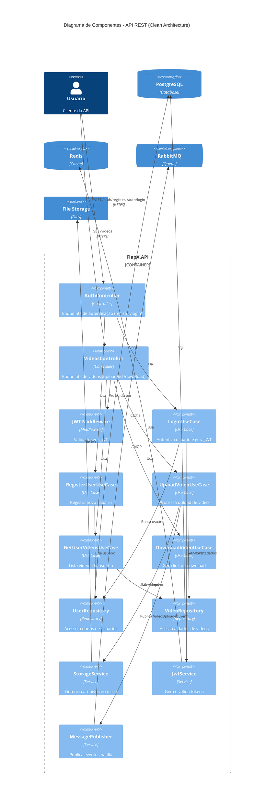

# Diagrama C4 - Nível 3: Componentes da API

Este diagrama mostra os componentes internos da API REST, seguindo Clean Architecture.



## Arquitetura em Camadas

### Presentation Layer (Controllers)
```
FiapX.API/Controllers/
├── AuthController.cs       → Register, Login
└── VideosController.cs     → Upload, List, Status, Download
```

**Responsabilidades:**
- Receber requisições HTTP
- Validar inputs
- Chamar Use Cases
- Retornar respostas HTTP

---

### Application Layer (Use Cases)
```
FiapX.Application/UseCases/
├── Auth/
│   ├── LoginUseCase.cs
│   └── RegisterUserUseCase.cs
└── Videos/
    ├── UploadVideoUseCase.cs
    ├── GetUserVideosUseCase.cs
    ├── GetVideoStatusUseCase.cs
    └── DownloadVideoUseCase.cs
```

**Responsabilidades:**
- Orquestrar lógica de negócio
- Coordenar repositories e services
- Validar regras de negócio
- Publicar eventos de domínio

---

### Domain Layer (Entities)
```
FiapX.Domain/Entities/
├── User.cs                 → Entidade de usuário
└── Video.cs                → Entidade de vídeo
```

**Responsabilidades:**
- Encapsular regras de negócio
- Validar invariantes
- Métodos de domínio (StartProcessing, CompleteProcessing, FailProcessing)

---

### Infrastructure Layer
```
FiapX.Infrastructure/
├── Repositories/
│   ├── UserRepository.cs
│   └── VideoRepository.cs
├── Services/
│   ├── StorageService.cs
│   ├── JwtService.cs
│   └── VideoProcessingService.cs
└── Messaging/
    └── MessagePublisher.cs
```

**Responsabilidades:**
- Implementar interfaces de domínio
- Acesso a banco de dados (EF Core)
- Acesso a sistemas externos
- Gerenciamento de arquivos

---

## Fluxo de Requisição: Upload de Vídeo

```
1. User → POST /api/videos/upload (multipart/form-data)
2. VideosController.Upload()
   ↓
3. JWT Middleware valida token
   ↓
4. UploadVideoUseCase.Execute()
   ↓ (paralelo)
   4a. StorageService.SaveVideoAsync() → File System
   4b. VideoRepository.AddAsync() → PostgreSQL
   ↓
5. MessagePublisher.PublishAsync(VideoUploadedEvent) → RabbitMQ
   ↓
6. Return 201 Created + VideoId
```

---

## Princípios Aplicados

✅ **Clean Architecture:** Dependências apontam para dentro  
✅ **SOLID:** Separação de responsabilidades  
✅ **DDD:** Entidades com comportamento  
✅ **CQRS:** Separação de comandos e queries  
✅ **Event-Driven:** Comunicação via eventos
