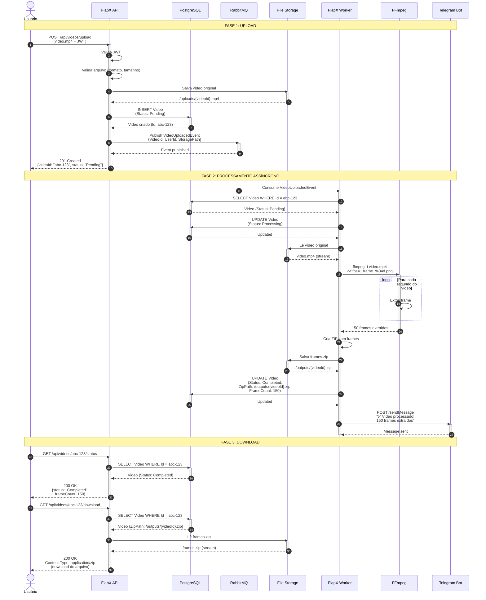
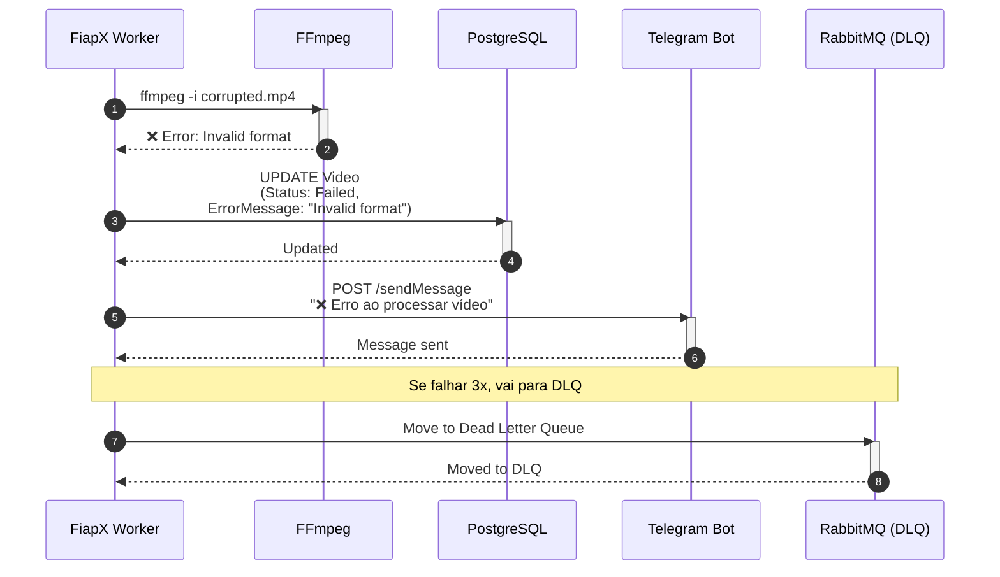
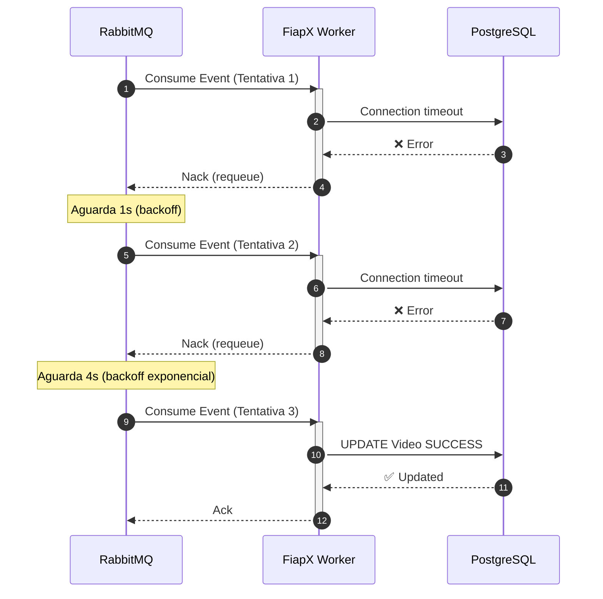

# Diagrama de Sequência - Processamento de Vídeo

Este diagrama mostra o fluxo completo desde o upload até o download do resultado.



## Cenários Alternativos

### Cenário 2: Erro no Processamento



---

### Cenário 3: Retry com Backoff



---

## Tempos Estimados

| Fase | Tempo Médio | Observação |
|---|---|---|
| Upload (API) | ~500ms | Depende do tamanho do arquivo |
| Enfileiramento | ~50ms | RabbitMQ |
| Processamento (Worker) | ~10-30s | Depende da duração do vídeo |
| Notificação | ~200ms | Telegram API |
| Download | ~1-3s | Depende do tamanho do ZIP |

---

## Estados do Vídeo

```
Pending → Processing → Completed
                    ↘ Failed
```

**Pending:** Vídeo enviado, aguardando processamento  
**Processing:** Worker está extraindo frames  
**Completed:** ZIP pronto para download  
**Failed:** Erro no processamento (formato inválido, corrompido, etc.)
