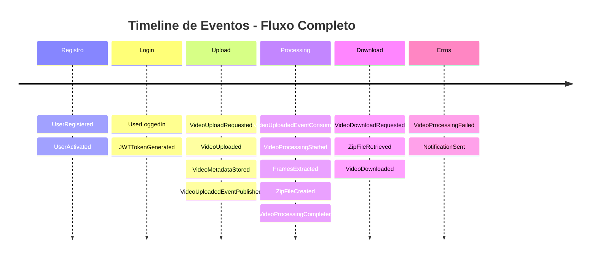
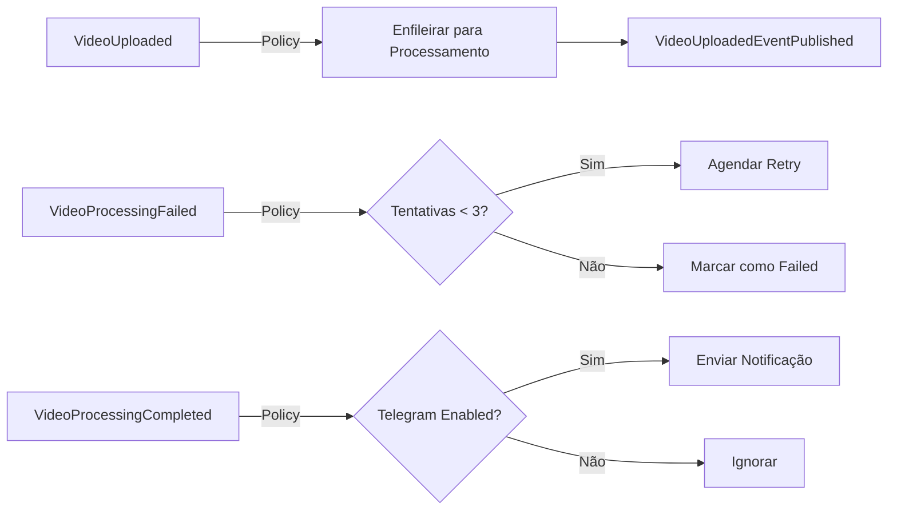
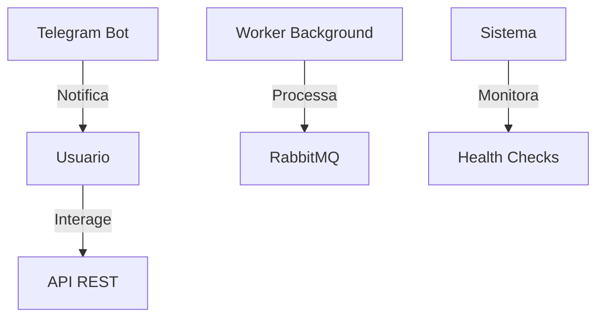
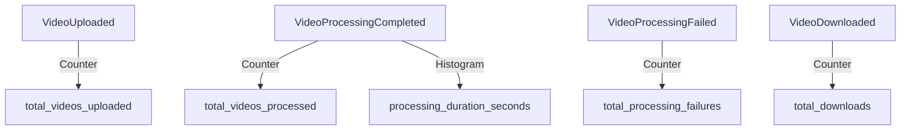
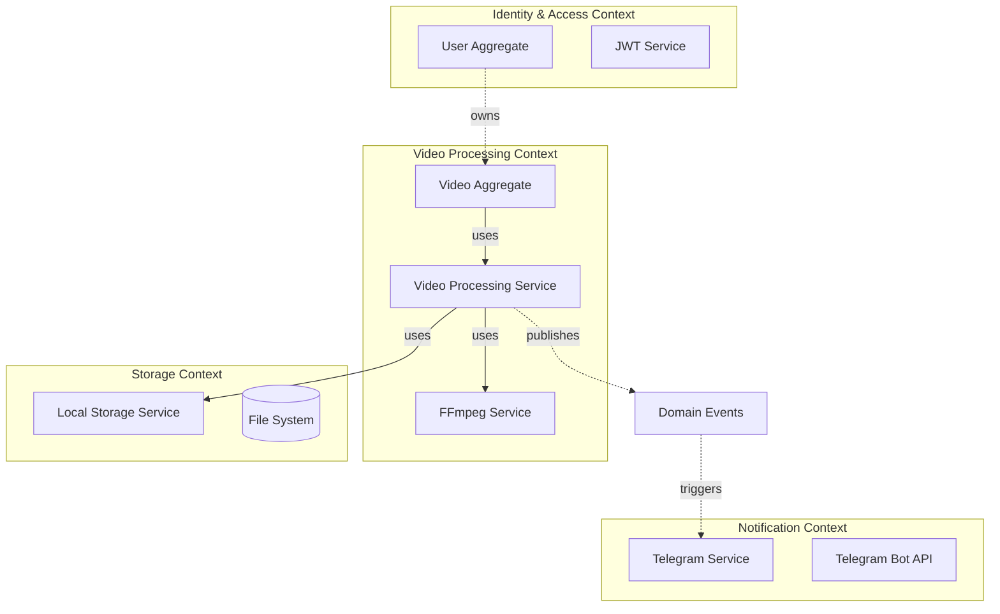
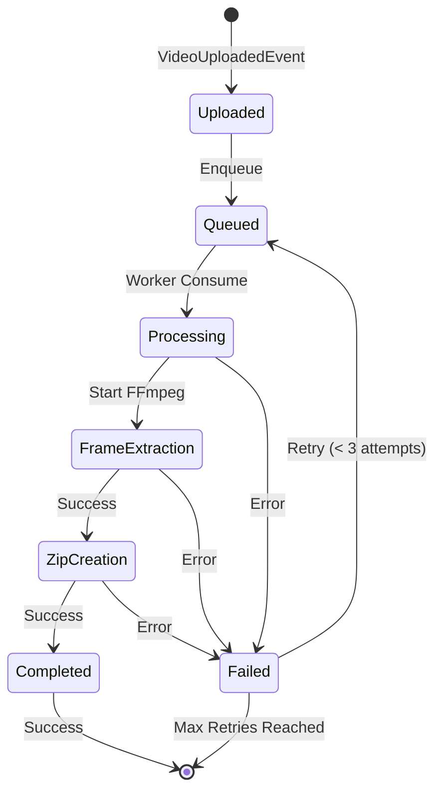
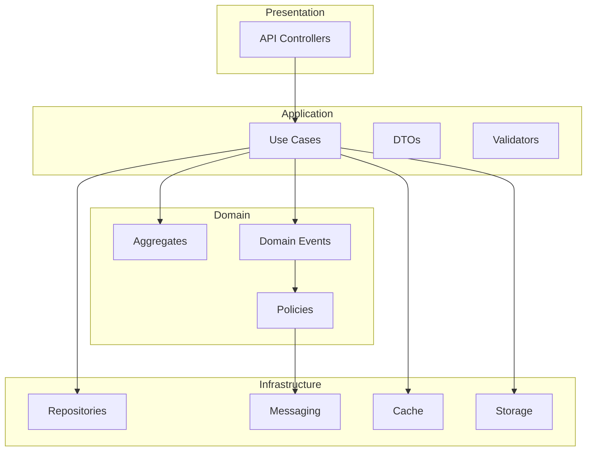

# 🎭 Event Storming - Sistema FiapX

## 📖 O que é Event Storming?

Event Storming é uma técnica de modelagem de domínio criada por Alberto Brandolini que usa eventos de domínio para entender e modelar processos de negócio complexos.

---

## 🎯 Domínios Identificados

### 1. **Autenticação e Gerenciamento de Usuários**
### 2. **Processamento de Vídeos**
### 3. **Armazenamento e Download**

---

## 🟧 Eventos de Domínio (Domain Events)

Eventos são **fatos que aconteceram** no passado (verbos no passado).



---

## 🔵 Comandos (Commands)

Comandos são **intenções de fazer algo** (verbos no imperativo).

### Autenticação
- `RegisterUser`
- `Login`
- `RefreshToken`

### Vídeos
- `UploadVideo`
- `GetUserVideos`
- `GetVideoStatus`
- `DownloadVideo`
- `RetryVideoProcessing`

### Processamento (Worker)
- `ProcessVideo`
- `ExtractFrames`
- `CreateZip`
- `NotifySuccess`
- `NotifyFailure`

---

## 🟩 Agregados (Aggregates)

Agregados são **conjuntos coesos de objetos** tratados como uma unidade.

### 1. **User Aggregate**
```
User (Aggregate Root)
├── Id: Guid
├── Email: Email (Value Object)
├── PasswordHash: string
├── Name: string
├── IsActive: bool
├── CreatedAt: DateTime
└── UpdatedAt: DateTime

Invariantes:
- Email deve ser único
- Senha deve ter no mínimo 6 caracteres
- Nome deve ter entre 3-100 caracteres
```

### 2. **Video Aggregate**
```
Video (Aggregate Root)
├── Id: Guid
├── UserId: Guid
├── OriginalFileName: string
├── StoragePath: string
├── ZipPath: string (nullable)
├── FileSizeBytes: long
├── Status: VideoStatus (Enum)
├── FrameCount: int (nullable)
├── ErrorMessage: string (nullable)
├── ProcessingDuration: TimeSpan (nullable)
├── UploadedAt: DateTime
├── ProcessedAt: DateTime (nullable)
└── UpdatedAt: DateTime

Invariantes:
- FileSizeBytes <= 2GB
- Status transitions seguem regras:
  * Uploaded → Queued → Processing → Completed/Failed
  * Failed → Queued (retry)
- Apenas vídeos Completed podem ser baixados
```

---

## 🟨 Políticas de Negócio (Business Policies)

Políticas são **regras automáticas** disparadas por eventos.



### Políticas Implementadas:

1. **Quando VideoUploaded**
   - ✅ Publicar evento na fila RabbitMQ
   - ✅ Marcar status como Queued

2. **Quando VideoProcessingFailed**
   - ✅ Se tentativas < 3: Retry com backoff exponencial
   - ✅ Se tentativas >= 3: Marcar como Failed definitivo
   - ✅ Se Telegram habilitado: Enviar notificação de erro

3. **Quando VideoProcessingCompleted**
   - ✅ Se Telegram habilitado: Enviar notificação de sucesso
   - ✅ Atualizar métricas Prometheus

4. **Quando UserRegistered**
   - ✅ Hash da senha com BCrypt
   - ✅ Email em lowercase
   - ✅ Marcar como ativo

---

## 👤 Atores (Actors)



### Personas:

**1. Usuário Final**
- Quer converter vídeos em frames
- Precisa de feedback sobre progresso
- Espera download rápido do resultado

**2. Worker (Sistema)**
- Consome eventos da fila
- Processa vídeos com FFmpeg
- Garante resiliência com retry

**3. Administrador (implícito)**
- Monitora health checks
- Visualiza logs no Seq
- Acompanha métricas

---

## 🎬 Event Storming Canvas Completo

```
┌─────────────────────────────────────────────────────────────────────────┐
│                           CONTEXTO: AUTENTICAÇÃO                         │
├─────────────────────────────────────────────────────────────────────────┤
│                                                                          │
│  [Usuario]  ──RegisterUser──>  🟧UserRegistered                        │
│                                      │                                   │
│                                      ├──> 🟩User Created                │
│                                      └──> Password Hashed                │
│                                                                          │
│  [Usuario]  ──Login──>  🟧UserLoggedIn                                 │
│                              │                                           │
│                              └──> 🟧JWTTokenGenerated                   │
│                                       │                                  │
│                                       └──> Token válido por 60min        │
│                                                                          │
└─────────────────────────────────────────────────────────────────────────┘

┌─────────────────────────────────────────────────────────────────────────┐
│                      CONTEXTO: UPLOAD E ENFILEIRAMENTO                   │
├─────────────────────────────────────────────────────────────────────────┤
│                                                                          │
│  [Usuario]  ──UploadVideo──>  🟧VideoUploadRequested                   │
│                                      │                                   │
│                                      ├──> Validar (< 2GB, formato)       │
│                                      │                                   │
│                                      ├──> 🟧VideoUploaded               │
│                                      │       │                           │
│                                      │       ├──> Save to Storage        │
│                                      │       └──> 🟩Video Entity         │
│                                      │                                   │
│                                      └──> 🟧VideoMetadataStored          │
│                                              │                           │
│                                              └──> 🟧VideoUploadedEvent   │
│                                                      │                   │
│                                                      └──> [RabbitMQ]     │
│                                                                          │
└─────────────────────────────────────────────────────────────────────────┘

┌─────────────────────────────────────────────────────────────────────────┐
│                    CONTEXTO: PROCESSAMENTO (WORKER)                      │
├─────────────────────────────────────────────────────────────────────────┤
│                                                                          │
│  [RabbitMQ]  ──>  🟧VideoUploadedEventConsumed                         │
│                         │                                                │
│                         ├──> 🟧VideoProcessingStarted                   │
│                         │       │                                        │
│                         │       └──> Status = Processing                 │
│                         │                                                │
│                         ├──> ProcessVideo (FFmpeg)                       │
│                         │       │                                        │
│                         │       ├──> Extract frames @ 1 FPS              │
│                         │       │                                        │
│                         │       └──> 🟧FramesExtracted                  │
│                         │                                                │
│                         ├──> CreateZip                                   │
│                         │       │                                        │
│                         │       └──> 🟧ZipFileCreated                   │
│                         │                                                │
│                         └──> 🟧VideoProcessingCompleted                 │
│                                 │                                        │
│                                 ├──> Update Video Aggregate              │
│                                 │     (Status, ZipPath, FrameCount)     │
│                                 │                                        │
│                                 └──> 🟨Policy: Notify Success           │
│                                       │                                  │
│                                       └──> [Telegram] (se habilitado)    │
│                                                                          │
│         ┌──────────────── EM CASO DE ERRO ────────────────┐             │
│         │                                                  │             │
│         │  🟧VideoProcessingFailed                        │             │
│         │      │                                           │             │
│         │      ├──> 🟨Policy: Retry ou Failed?           │             │
│         │      │       │                                  │             │
│         │      │       ├──> Tentativas < 3                │             │
│         │      │       │     └──> Retry com backoff        │             │
│         │      │       │                                  │             │
│         │      │       └──> Tentativas >= 3               │             │
│         │      │             └──> Status = Failed          │             │
│         │      │                                           │             │
│         │      └──> 🟨Policy: Notify Error                │             │
│         │            └──> [Telegram] (se habilitado)       │             │
│         │                                                  │             │
│         └──────────────────────────────────────────────────┘             │
│                                                                          │
└─────────────────────────────────────────────────────────────────────────┘

┌─────────────────────────────────────────────────────────────────────────┐
│                       CONTEXTO: CONSULTA E DOWNLOAD                      │
├─────────────────────────────────────────────────────────────────────────┤
│                                                                          │
│  [Usuario]  ──GetVideoStatus──>  Query Video Aggregate                 │
│                                        │                                 │
│                                        └──> Return Status DTO            │
│                                                                          │
│  [Usuario]  ──DownloadVideo──>  🟧VideoDownloadRequested               │
│                                       │                                  │
│                                       ├──> Validate (Completed?)         │
│                                       │                                  │
│                                       ├──> 🟧ZipFileRetrieved           │
│                                       │       │                          │
│                                       │       └──> Read from Storage     │
│                                       │                                  │
│                                       └──> 🟧VideoDownloaded             │
│                                                                          │
└─────────────────────────────────────────────────────────────────────────┘
```

---

## 🔴 Hotspots (Pontos Críticos)

Áreas que precisam de atenção especial:

### 1. **Processamento de Vídeos Grandes**
**Problema:** Vídeos próximos de 2GB podem demorar muito  
**Solução:** Circuit breaker, timeout, retry com backoff exponencial  
**Status:** ✅ Implementado

### 2. **Falha no FFmpeg**
**Problema:** FFmpeg pode falhar por formato incompatível  
**Solução:** Validação de formato no upload, mensagens de erro claras  
**Status:** ✅ Implementado

### 3. **Consistência Eventual**
**Problema:** Usuário pode consultar status antes da fila processar  
**Solução:** Status "Queued" indica que está aguardando processamento  
**Status:** ✅ Implementado

### 4. **Armazenamento Crescente**
**Problema:** Storage pode encher rapidamente  
**Solução:** Limpeza periódica de vídeos antigos (não implementado)  
**Status:** ⚠️ Futuro

---

## 📊 Métricas de Negócio

Eventos que geram métricas:



---

## 🎯 Bounded Contexts



---

## 🔄 Saga: Video Processing Saga



---

## 🏷️ Ubiquitous Language (Linguagem Ubíqua)

Termos do domínio que devem ser usados por todos:

| Termo | Definição |
|-------|-----------|
| **Video** | Arquivo de vídeo enviado pelo usuário para processamento |
| **Frame** | Imagem extraída do vídeo em um determinado timestamp |
| **Processing** | Ato de extrair frames de um vídeo usando FFmpeg |
| **ZIP** | Arquivo compactado contendo todos os frames extraídos |
| **Status** | Estado atual do vídeo no pipeline (Uploaded, Queued, Processing, Completed, Failed) |
| **Upload** | Ação de enviar um vídeo para o sistema |
| **Queue** | Fila de mensagens (RabbitMQ) onde vídeos aguardam processamento |
| **Worker** | Serviço em background que consome eventos e processa vídeos |
| **Retry** | Tentativa automática de reprocessar vídeo que falhou |
| **Circuit Breaker** | Mecanismo que interrompe requisições quando há muitas falhas |

---

## 📝 User Stories Mapeadas

### US-001: Upload de Vídeo
```
Como usuário
Quero fazer upload de um vídeo
Para que ele seja processado em frames

Critérios de Aceitação:
✅ Arquivo deve ser <= 2GB
✅ Formato deve ser mp4, avi, mov, mkv, wmv, flv, webm, m4v
✅ Retornar 202 Accepted com ID do vídeo
✅ Status inicial deve ser "Uploaded"

Eventos: VideoUploadRequested → VideoUploaded → VideoMetadataStored → VideoUploadedEventPublished
```

### US-002: Consultar Status
```
Como usuário
Quero consultar o status do meu vídeo
Para saber quando estará pronto para download

Critérios de Aceitação:
✅ Mostrar status atual (Uploaded, Queued, Processing, Completed, Failed)
✅ Mostrar quantidade de frames (se completed)
✅ Mostrar mensagem de erro (se failed)
✅ Mostrar tempo de processamento (se completed)

Eventos: Nenhum (Query)
```

### US-003: Download do ZIP
```
Como usuário
Quero baixar o ZIP com os frames
Para utilizar as imagens extraídas

Critérios de Aceitação:
✅ Apenas vídeos com status "Completed" podem ser baixados
✅ Retornar arquivo ZIP válido
✅ Nome do arquivo deve incluir timestamp

Eventos: VideoDownloadRequested → ZipFileRetrieved → VideoDownloaded
```

---

## 🎨 Diagrama Completo - Visão Geral



---

**Desenvolvido com Event Storming para FIAP** 🎭
